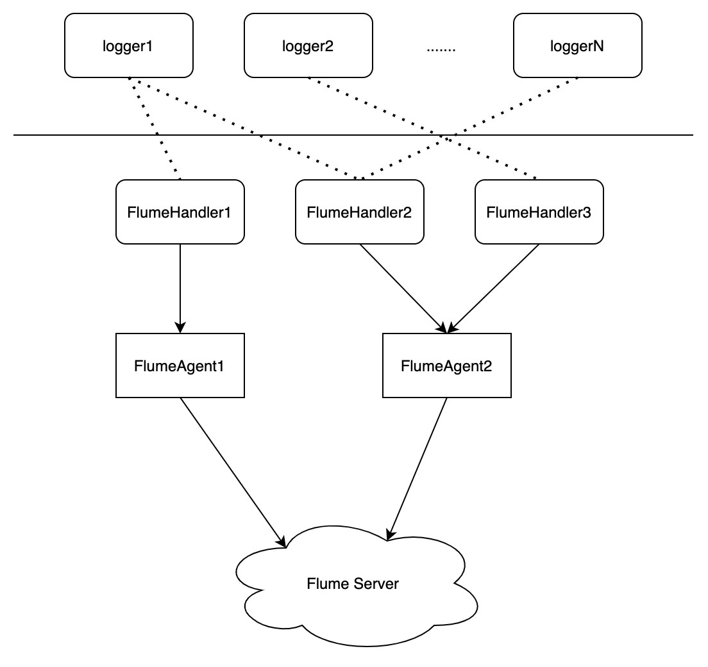
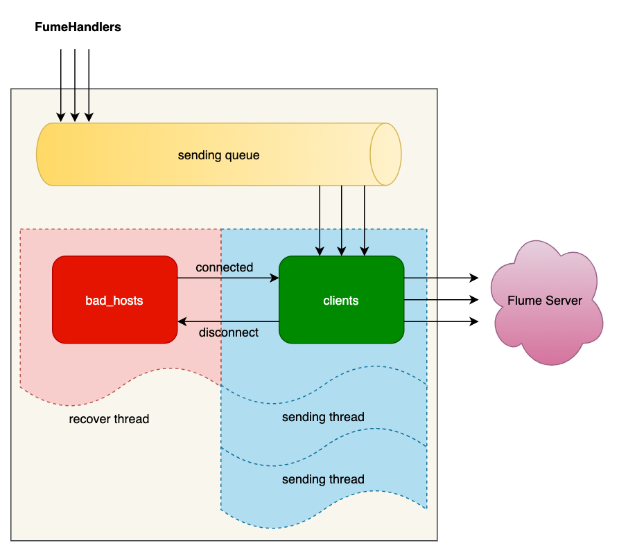

# flumehandler

flume handler for logging, sending log events to Flume.

```
pip install flumehandler
```

### Architecture





### Usage

```python
from flumehandler import FlumeAgent, FlumeHandler

agent = FlumeAgent(hosts=['10.10.10.10'], port=8888, batch_size=20, max_size=10000)
agent.start()

handler = FlumeHandler(agent, type='accesslogs', host='10.10.10.125')
handler.set_env('{datetime}e', lambda: time.time())
handler.set_env('{host}e', '10.10.10.125')
handler.set_env(app='api')

logger = logging.getLogger("gunicorn.access")
logger.addHandler(handler)

logger.info(...)
```

### Prerequesites

- `thrift = "0.13.0"`

